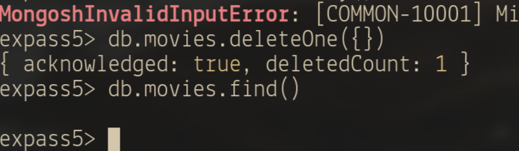

# Exeriment assignment 3: MongoDB

## Technical issues
I had issues installing mongodb on fedora, because I am using it on arm architecture.

I added the mongodb proprietary repository to dnf by writing this file, as found on their website:
[Install instructions](https://www.mongodb.com/docs/manual/tutorial/install-mongodb-on-red-hat/#std-label-install-mdb-community-redhat-centos)

```
# /etc/yum.repos.d/mongodb-org-7.0.repo

[mongodb-org-7.0]
name=MongoDB Repository
baseurl=https://repo.mongodb.org/yum/redhat/9/mongodb-org/7.0/x86_64/
gpgcheck=1
enabled=1
gpgkey=https://pgp.mongodb.com/server-7.0.asc
```

I had to change the architecture to `aarch64`.

I then ran:

```bash
sudo dnf install mongodb-org
```

When trying to run mongoshell, I got this error:

```bash
 ❯ mongosh
mongosh: OpenSSL configuration error:
A00F9F12FFFF0000:error:030000A9:digital envelope routines:alg_module_init:unknown option:../deps/openssl/openssl/crypto/evp/evp_cnf.c:61:name=rh-allow-sha1-signatures, value=yes
```

I googled the error message and found this forum post as the top result: 
[OpenSSL error when starting Mongosh](https://www.mongodb.com/community/forums/t/openssl-error-when-starting-mongosh/243323/2)

One solution was to downgrade the mongodb version, so it seems that this is
an issue caused by a recent update.  It seemed like a tedious workaround, so I
tried another solution. That was to install `mongodb-mongosh-shared-openssl3`.
To do this I had to completely uninstall `mongodb-org` and `mongodb-mongosh`,
because of dependencies. I then installed the shared oppenssl version of
mongosh, and reinstalled `mongodb-org`. This worked.

## Screenshots:

### The correct validation of the installation package

I installed through the official mongodb repository for Red Hat Linux. 
Here is a screenshot of the verification being handled by my package manager :)


### Relevant results obtained during Experiment 1

I chose to do the tutuorial found at 
[the mongoshell documentation](https://www.mongodb.com/docs/mongodb-shell/crud/)
instead of the one in the expass5 instructions. I found them to contain a lot
of the same content, but they were shorter and easier to read.

#### Create


#### Read

Ignore my typo in the middle ;)

Using db.movies.find() reveals all documents in the movies collection.
There is currently just one.

Specifying a search term, such as `{ Title: "The Favourite" }` 
only returns the entry that matches this search.

#### Update

Here I made a more complex query, to discover that there are a lot of strict
rules about how my parantheses and brackets should be placed.

#### Delete

I used deleteOne with an empty query to delete the first match.
There was only one match, and the collection is now empty.

#### bulkWrite

I composed a simple bulk-write from two instertOne statements.

### Experiment 2 example working and the additional Map-reduce operation (and its result) developed by each of you.
#### Map-reduce example:


#### Custom map-reduce:


## Reason about why your implemented Map-reduce operation in Experiment 2 is useful and interpret the collection obtained.
I decided to group by product that had been bought, and sum the price from all the purchases.
This gives us the total profit for each product.

### Code

```javascript
var customMapFunction = function() {
    for (var i = 0; i < this.items.length; i++) {
        item = this.items[i].sku;
        sumForThisItem = this.items[i].price * this.items[i].qty;

        emit(item, sumForThisItem);
    }
}

var customReduceFunction = function(item, sum) {
    totalSum = 0
    for (var i = 0; i < sum.length; i++) {
        totalSum += sum[i]
    }
    return totalSum
}
```

To run these:
```mongosh
db.orders.mapReduce( customMapFunction, customReduceFunction, { out: "map_reduce_custom" } )
```

### Collection obtained:

```json
[
  { _id: 'chocolates', value: 150 },
  { _id: 'oranges', value: 157.5 },
  { _id: 'carrots', value: 15 },
  { _id: 'apples', value: 87.5 },
  { _id: 'pears', value: 25 }
]
```

I could have chosen a better name for the value field, like totalSum or something,
but I did not figure out how to do that.
If I tried returning an object with key/value pairs, these became a nested document.

Maybe a finalize function would do the trick?

## Pending issues
None! The tasks were easy to follow and I learned a lot!

I would have liked to delve a bit deeper into map-reduce and aggregation pipelines,
but there was a lot to read to understand them properly.
From what I understood, map-reduce is deprecated and the behaviour can easily
be replicated using aggregation pipelines. The next thing I wanted to do
was to translate my map-reduce function into one of those.
